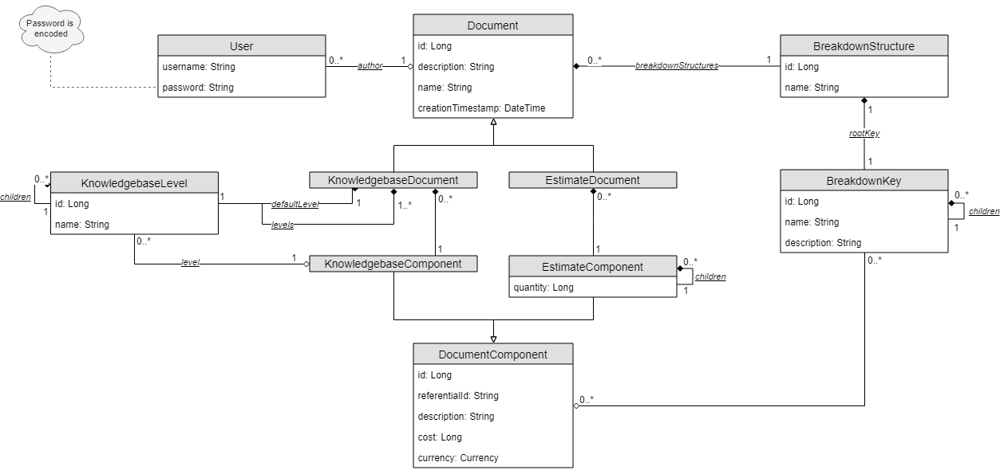
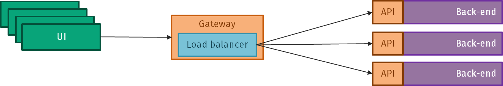

# Strangler Fig workshop
This is a workshop to learn how to use the Strangler Fig pattern to migrate a monolithic application to a service-based architecture. During the workshop, your goal will be to migrate the application in this repository to a service-based architecture using the Strangler Fig pattern.

**Contents**
- [The application](#the-application)
  - [Understanding the domain](#understanding-the-domain)
  - [The application structure](#the-application-structure)
- [Postman collection](#postman-collection)
- [The goal](#the-goal)
  - [Game plan](#game-plan) 
  - [Deliverables](#deliverables)
  - [Bonus](#bonus)
- [Prerequisites](#prerequisites)
  - [Option A: Docker](#option-a-docker)
  - [Option B: Local development environment](#option-b-local-development-environment)
- [Useful resources](#useful-resources)
    - [Strangler Fig pattern](#strangler-fig-pattern)
    - [Spring Boot](#spring-boot)
    - [Spring Cloud Gateway](#spring-cloud-gateway)

## The application
### Understanding the domain
The application is a simple monolithic application that represents a simplified version of Cleopatra Enterprise's core functionality: the organization of documents and components. The application has two main entities: `Document` and `DocumentComponent`. Documents are often specialized to a specific purpose, and components are the building blocks of documents. This application represents two of the most important document types in Cleopatra: estimates and knowledgebases.

A knowledgebase is a document that contains template components that can be used to create other documents. These components are organized in levels, where each level may represent a different section of the document (e.g. the level of detail on the component, or a specific sub-domain).

An estimate is a document that contains components that represent the items that are being estimated. These components are organized in a tree structure, where each component may have child components that represent sub-items. Each component may also have a quantity and a unit price, which are used to calculate the total price of the component. The total price of the document is the sum of the total prices of all components in the document. Estimate components may be manually defined, or derived from a knowledgebase.

Across both document types it's possible to 'tag' components with a set of breakdown keys. These keys are used to group components in different ways, and can be used to calculate the total price of the document in different ways.

In the diagram below, you can see the entities in the application and their relationships. 

### The application structure
> [!IMPORTANT]
> Several packages contain a `package-info.java` file. This file is used to document the package, and contains several hints that may help you understand the package and its relationship to other packages.

The application is a Spring Boot application that uses Spring Data JPA to interact with a SQL Server database. The application is divided modules, each representing a different part of the application. The modules are:
- `core`: Contains shared elements of the application, such as common entities and repositories.
- `estimating`: Contains the functionality related to estimates.
- `knowledgebase`: Contains the functionality related to knowledgebases.

The application also has a dedicated `security` module that contains the security configuration for the application. The security module is shared across all other modules.

> [!NOTE]
> The security module is constrained to a single service account with credentials configured in the `application.properties` file. The Postman collection below is pre-configured with these credentials.

Each module is organized into three main packages:
- `domain`: Contains the entities that represent the domain of the module.
- `service`: Contains the services that interact with the entities, either directly as repositories, or indirectly as other services.
- `web`: Contains the controllers that expose the services to the outside world.

## Postman collection
To help you test the application, we've created a Postman collection that contains all the requests you need to test the application. You can find the collection in the [strangler-fig-workshop.postman_collection.json](strangler-fig-workshop.postman_collection.json) file. To import the collection into Postman, click on the hamburger menu in the top left corner, select `File > Import` and select the file.

The collection contains a configuration with component IDs which are commonly re-used in the requests. You can find the configuration in the `Variables` tab in the collection. Authorization is also configured in the collection, so you don't need to worry about setting up the authorization headers.

> [!NOTE]
> There is no sample data in the database, so you need to create the data you need to test the application. You can use the `POST` requests in the collection to create the data you need.

## The goal
The goal of the workshop is to migrate the application to a service-based architecture using the Strangler Fig pattern. Once the migration is complete, the application should be divided into individually deployable services that can be scaled independently. The services should be accessible through a gateway that routes requests to the appropriate service. 

You are free to design the services in any way you see fit, as long as the end result is a service-based architecture with _minimal code duplication_. A basic example of how the services could be divided is shown in the diagram below.

> [!NOTE]
> The diagram is just an example of how the services could be divided. You are free to design the services in any way you see fit. The UI is not part of the migration, so you don't need to worry about how a UI will interact with the services. You can use the Postman collection to test the services.

### Game plan
To help you get started, you can consider the following steps to migrate the application. Make sure to consider _why_ you're making the changes you're making, and how they fit into the Strangler Fig pattern.
- Consider where you can split the application into services, and how they can interact with each other
  - Split along domain boundaries, and consider how the services can interact with each other
  - Remember that the application consists of at least three modules: `core`, `knowledgebase`, and `estimating`
- Create a separate Maven module for each service you want to create
  - You can use the existing `application` and `gateway` modules as a starting point
  - Consider how to share common elements between services, a lot of code in the `core` package is likely to be shared between services
- Set up the gateway service that routes requests to the appropriate service
  - You can re-use the existing authentication across services, or set up a separate authentication service
    - Note: The former is likely to be simpler, keep time constraints in mind 
  - The provided `gateway` module is a starting point for the gateway service
  - Refer to the [Useful resources](#useful-resources) section for more information on Spring Cloud Gateway
- Migrate the modules to the appropriate service

> [!NOTE]
> If you identify parts of the application that cannot be migrated using the existing API design, you are free to change the API design to better fit the service-based architecture. Just make sure to document the changes you make. You do not need to consider backwards compatibility with the existing monolithic application.

### Deliverables
To complete the workshop, you need to deliver the following:
1. The source code of the resulting services.
2. A diagram showing the services and how they interact with each other. 
3. A brief description of the services and how they interact with each other.
4. A brief description how you applied Strangler Fig in the migration.

You can deliver the source code in any way you see fit. You can either fork this repository and commit the changes to your fork, or you can create a new repository with the source code. Deliverables 3 and 4 can be presented at the end of the workshop, you don't have to deliver these in written form.

### Bonus
If you want to go the extra mile, you can also investigate some of the following:
- Implementing a service for authentication and authorization (e.g. using Spring Security connected to Keycloak)
- Implementing a monitoring solution for the services (e.g. Prometheus and Grafana)
- Implementing a logging solution for the services (e.g. ELK stack)
- Dockerizing the services, and setting up a CI/CD pipeline to deploy the services to a Kubernetes cluster
- Optimizing query performance in the services (see logged queries in the console)

Note that these are optional, and you are not required to implement them to complete the workshop. If you have ideas for other things you'd like to investigate, feel free to do so!

## Prerequisites
### Option A: Docker
To participate in this workshop using Docker, you only need to have Docker installed on your computer. You can download Docker from [here](https://www.docker.com/products/docker-desktop). Once you've installed Docker, the application will automatically set up the necessary infrastructure for you.

### Option B: Local development environment

> [!NOTE]
> SQL Server is a recommendation for this workshop, but you can use any SQL database you're comfortable with (e.g. MySQL).

To participate in this workshop using a local environment, you only need to have a computer with SQL Server installed. You can use the free developer version of SQL Server, which is SQL Server Developer. You can download SQL Server from [here](https://www.microsoft.com/en-us/sql-server/sql-server-downloads), and SQL Server Management Studio (SSMS) from [here](https://learn.microsoft.com/en-us/sql/ssms/download-sql-server-management-studio-ssms?view=sql-server-ver16#download-ssms).

Once you've installed SQL Server, open SQL Server Management Studio (SSMS) and create a new database called `stranglerfig`. You can do this by right-clicking on the `Databases` node in the Object Explorer, selecting `New Database`, and entering `stranglerfig` as the database name. You can leave the rest of the settings as default.

After setting up the databse, you need to make two changes to the application:
1. If you're not using the default Service Account (`sa`) to connect to the database, you need to update the `application.properties` file in the `src/main/resources` folder to use your credentials. You can find the file [here](src/main/resources/application.properties).
2. You need to disable Docker Compose integration in the `pom.xml` file. To do so, comment out the `spring-boot-docker-compose` dependency. You can find the file [here](pom.xml).

### Useful extra tools
- [Postman](https://www.postman.com/downloads/): A tool to test APIs
- [Code with Me](https://www.jetbrains.com/code-with-me/): A tool to collaborate on code in real-time using IntelliJ-based IDEs
- [Draw.io](https://app.diagrams.net/): A tool to create diagrams

## Useful resources
### Strangler Fig pattern
- [Strangler Fig Application, Martin Fowler](https://martinfowler.com/bliki/StranglerFigApplication.html)
- [Strangler Fig Pattern, Microsoft Learn](https://learn.microsoft.com/en-us/azure/architecture/patterns/strangler-fig)

### Spring Boot
- [Spring Boot documentation](https://docs.spring.io/spring-boot/index.html)
- [Spring Data JPA documentation](https://docs.spring.io/spring-data/jpa/reference/)
- [Spring Security documentation](https://docs.spring.io/spring-security/reference/)

### Spring Cloud Gateway

> [!NOTE]
> You are not required to use Spring Cloud Gateway in the workshop. It's just a suggestion for how you could route requests to the services. The provided `gateway` module is a starting point for the gateway service using Spring Cloud Gateway.

- [Spring Cloud Gateway documentation](https://docs.spring.io/spring-security/reference/)
- [Spring Cloud Gateway tutorial, Baeldung](https://www.baeldung.com/spring-cloud-gateway)
- [Building a Gateway, Spring Guides (GitHub)](https://github.com/spring-guides/gs-gateway/)
